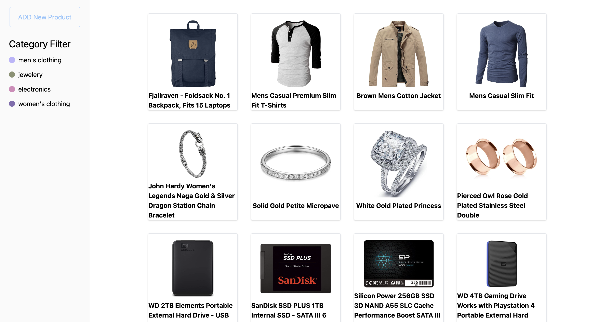
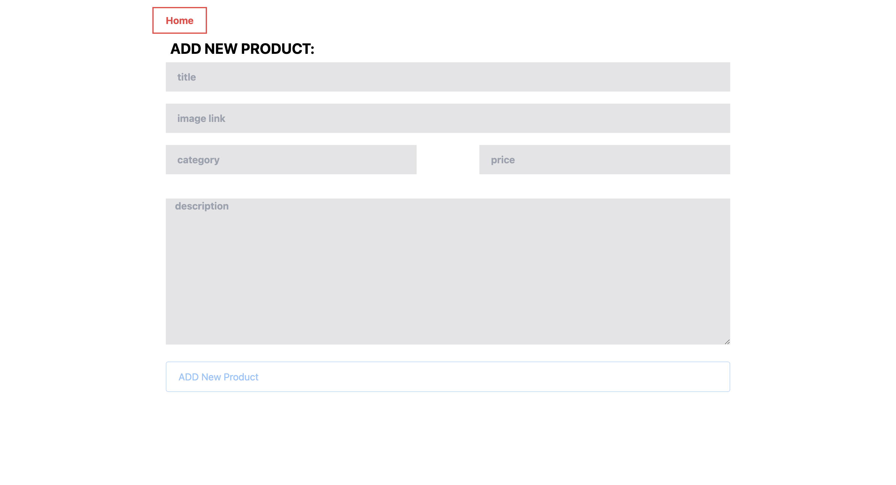
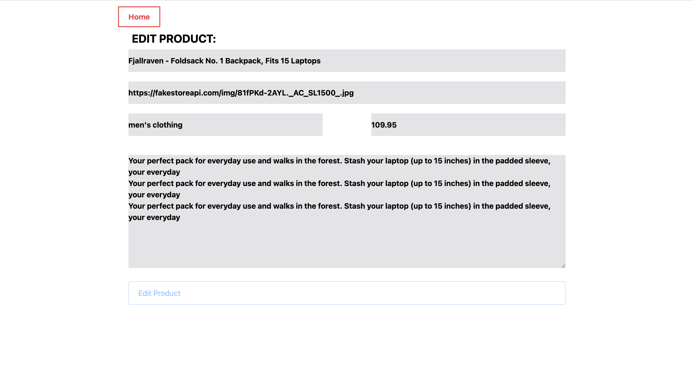

# 🛍️ Easy Cart Explorer

## 📌 Overview
This project is a React-based e-commerce web application that integrates with the [FakeStore API](https://fakestoreapi.com/) to provide users with a seamless shopping experience. Users can:
- View a variety of products, including men's clothing, women's clothing, jewelry, and electronics.
- Add new products with details such as title, price, description, and image.
- Edit or delete existing products.
- Filter products using the sidebar categories.
- Quickly add new products using the "Add Product" button on the home page.

## Screenshots




## 🚀 Features
- **Dynamic Product Management**: Users can create, read, update, and delete products in real time.
- **Category-Based Filtering**: Sidebar allows users to filter products efficiently.
- **Interactive UI/UX**: Built with Tailwind CSS for a modern and responsive design.
- **API Integration**: Fetches real-time product data from FakeStore API.
- **Notifications**: Utilizes React Toastify for user-friendly alerts.
- **Optimized Performance**: Developed using Vite for fast build and development speed.

## 🛠️ Tech Stack
| Technology      | Purpose                              |
|---------------|---------------------------------|
| React         | Frontend framework              |
| React Router  | Client-side navigation         |
| Axios        | API requests handling          |
| Tailwind CSS  | Styling framework              |
| React Toastify | User notifications            |
| Vite         | Development and build tool      |

## 📦 Installation & Setup
Follow these steps to set up the project on your local machine:

1. **Clone the Repository**
   ```sh
   git clone https://github.com/rjrishis/Easy-Cart-Explorer.git
   cd Easy-Cart-Explorer
   ```
2. **Install Dependencies**
   ```sh
   npm install
   ```
3. **Run the Development Server**
   ```sh
   npm run dev
   ```

## 🔧 Usage Guide
- Browse products displayed as interactive cards on the home page.
- Use the **"Add Product"** button to create new products.
- Click on a product card to **edit or delete** a product.
- Use the **sidebar categories** to filter products based on their type.
- Receive **real-time notifications** for actions like adding, editing, or deleting products.

## 📷 Screenshots
*(Include screenshots of your application here to showcase UI/UX)*

## 🚀 Deployment
This project can be easily deployed using platforms like Vercel or Netlify.

## 🤝 Contributing
Contributions are welcome! If you'd like to contribute:
1. Fork the repository.
2. Create a new branch (`feature/your-feature-name`).
3. Commit your changes and push them.
4. Submit a pull request for review.

## 📜 License
This project is licensed under the **MIT License**.

---
### 🔗 Additional Links
- FakeStore API: [https://fakestoreapi.com/](https://fakestoreapi.com/)
- React Documentation: [https://react.dev/](https://react.dev/)

